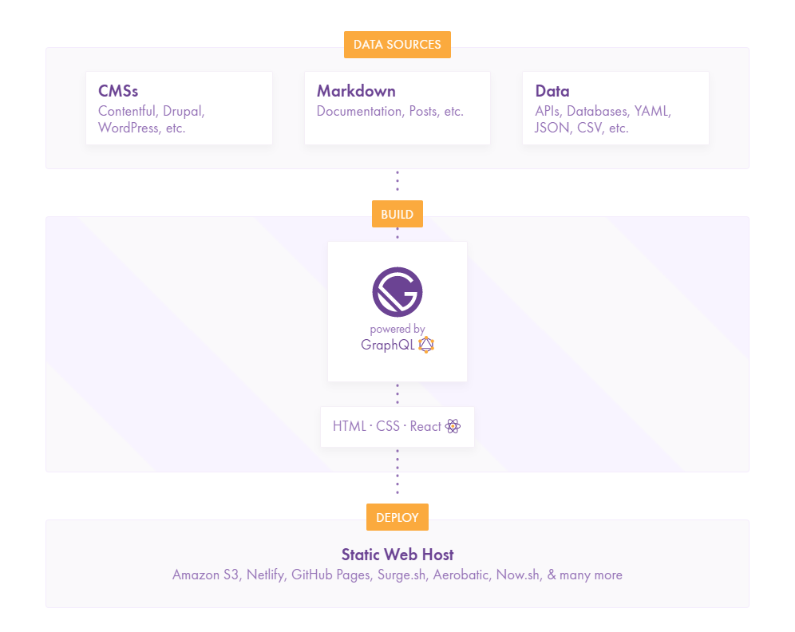
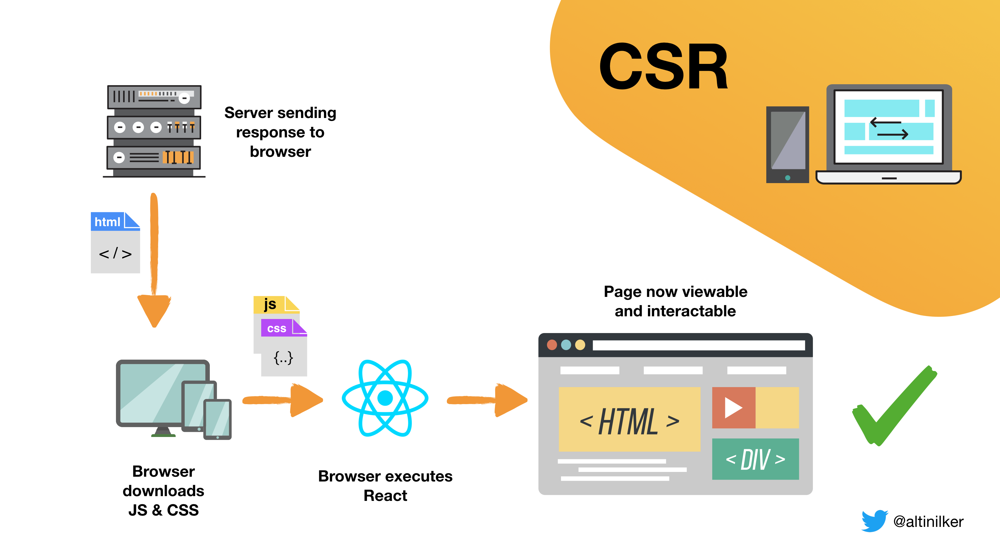
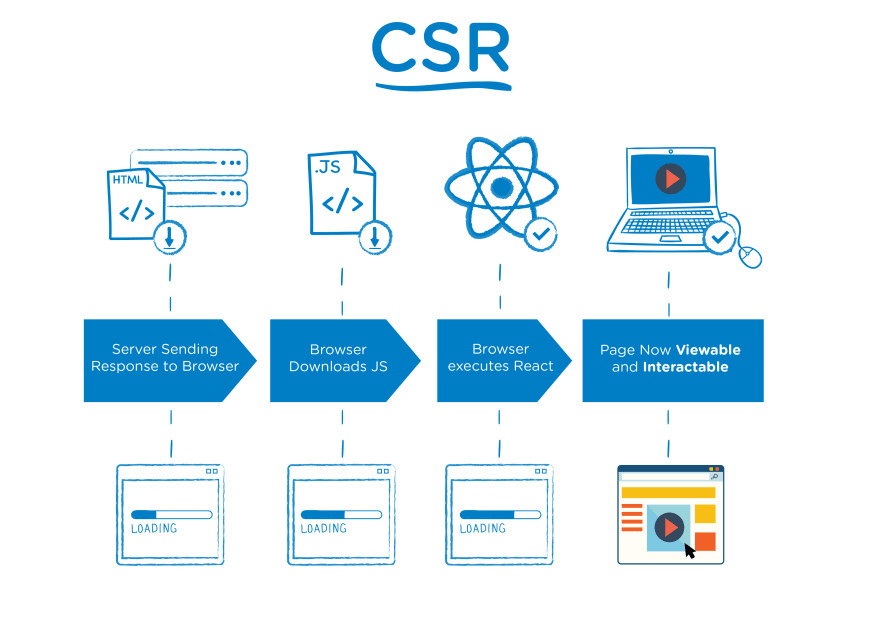
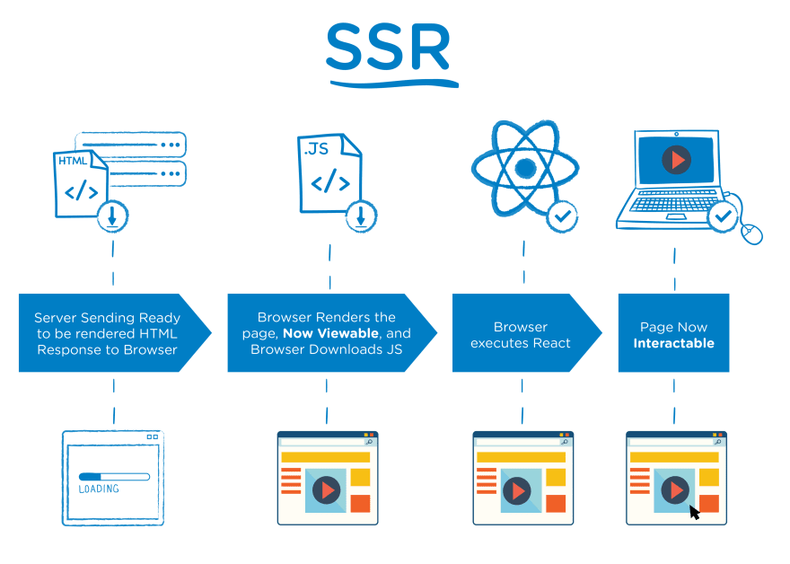

## Gatsby

É um gerador estático, que básicamente temos uma fonte de dados (pode vir de um cms, markdown ou json), ele vai pegar esse dado e vai fazer uma build dentro do gatsby, gerando no final o nosso html,css e js, e ai podemos fazer o deploy disso em qualquer servidor, já que é estático.

Ele reúne as melhores funcionalidades do React e outras diversas ferramentas modernas em um mesmo pacote, facilitando a criação de sites e aplicações web incrivelmente rápidos e poderosos.

Com o Gatsbyjs você pode desenvolver em React e quando fizer o "build" de seu código ele irá gerar arquivos estáticos que serão acessados pelos usuários. Isto traz diversas vantagens para seus sites como suporte a SEO, uma velocidade incrível, sistema de cache, e diversos outros itens.



### React e o SEO

O problema, imaginemos criar um site em react com o famoso create-react-app, porém o SEO é algo necessário para esse caso. Mas o react trabalha com CSR (Client Side Rendering) ele não consegue uma boa indexação pois quando o bot do Google acessa o site ele teoricamente não "existe" o que dificulta na indexação de algumas páginas.

Basicamente o fluxo que o crawler estava fazendo era: Acessa o site > O site solicita informações da API > As informações são dispostas na tela > Indexa a página > o crawler não visualiza nenhum link ou páginas extras > sai do site, assim a única página indexada era a home (index), as páginas restantes simplesmente não existiam para o Google.



### Solução com Gatsby

O SEO funciona com o Gatsby pois todas as páginas do site já estão criadas no servidor, sempre que você faz o processo de build no Gatsby ele cria todas as páginas do site e deixa elas prontas para serem acessadas, com todo o conteúdo gerado. Então quando o crawler do Google vier em seu site todo o conteúdo estará disposto para que ele possa ler.


### Mas e se precisarmos atualizar algo?

É uma abordagem interessante, mas atente-se a um ponto: E se você quiser atualizar alguma informação nas páginas geradas?  Precisará rodar a build novamente para atualizar informações dispostas nos elementos.

Uma solução para evitar essa build constante é o client-data-fetching mas isso faz com que seu site seja um sistema React normal, Axios -> retornar informações da api -> popula os components. É interessante se algumas páginas utilizarem desse recurso, porém se todo o site precisa disso você perde algumas funcionalidades do Gatsby e dependendo de como for estruturado esse fetch o crawler do Google não conseguirá ler as informações a tempo, e resultará em perda de SEO.

E esse ponto é crítico caso você precise atualizar muitas ~imagine muiiiiitas~ páginas que já estão geradas e então precisa fazer build novamente, e uma build muito grande no Gatsby leva alguns minutos...

### Como funciona a renderização do lado do cliente CSR

Quando o navegador faz a solicitação inicial ao servidor SPA, o servidor retorna o arquivo HTML que se parece com isso.

```
<!DOCTYPE html>
<html lang="en">
  <head>
    <meta charset="UTF-8" />
    <title>Single Page Application</title>
  </head>
  <body>
    <-- O div "root" obterá o conteúdo do JS posteriormente -->
    <div id="root"></div>
    <script src="index.js"></script>
  </body>
</html>
```
Após o carregamento inicial do HTML e CSS, o navegador solicita o restante do aplicativo que vem em um arquivo JS. Enquanto esse JS estiver sendo carregado e analisado, a página ficará em branco. O conteúdo ficará visível e intratável depois que o arquivo JS for analisado.



A vantagem da renderização no lado do cliente (CSR) é que, uma vez que a página carrega, toda a navegação subsequente no site será rápida, uma vez que não é necessário carregar mais páginas do servidor, já que é uma SPA.

Uma grande desvantagem alem desse primeiro render ser lento, surge quando se olha para o SEO (Search Engine Optimization). Os rastreadores da Web podem não analisar o JavaScript e carregar o conteúdo; portanto, eles podem ver apenas uma página vazia.

### Solução com server side render SSR

Podemos resolver esses problemas usando a renderização no servidor. O SSR está processando o aplicativo em uma string (HTML) no próprio servidor e enviando-o para o navegador. Isso leva o trabalho de renderização do cliente para o servidor. Portanto, quando o navegador recebe o arquivo HTML inicial, há conteúdo para o usuário ver, diferentemente de um site de CSR.



A desvantagem de usar apenas SSR é que ela torna a navegação no site lenta, pois cada página precisa ser renderizada e buscada no servidor. Isso também aumenta a carga no servidor.


### Conclusão sobre CSR vs SSR

O CSR torna o aplicativo mais rápido e mais interativo. O SSR pode acelerar a primeira renderização do site e melhorar o SEO. 

## GraphQL

Serve para pegar os dados e separar de forma mais organizada e otimizada, os dados que desejamos

## StyleComponents

Trabalhar com css dentro do javascript

## Algolia

Para a busca vamos ultilizar o algolia, é uma solução open-source, mas que tem também os modulos pagos, ele tem um sistema de busca muito bom, uma performance incrivel.

## NestlifyCms

Ele será a nossa fonte de dados


## Nestlify

Para realizar o deploy