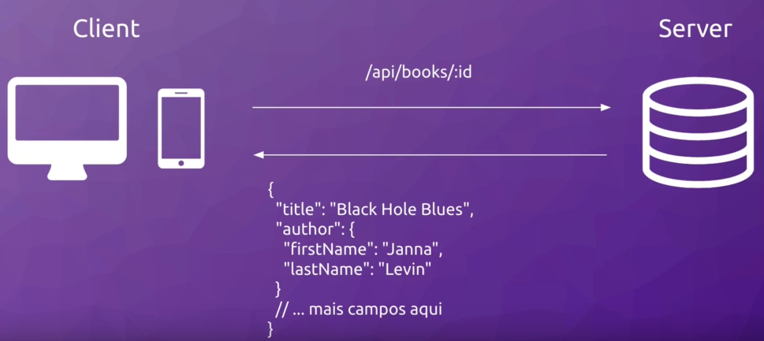
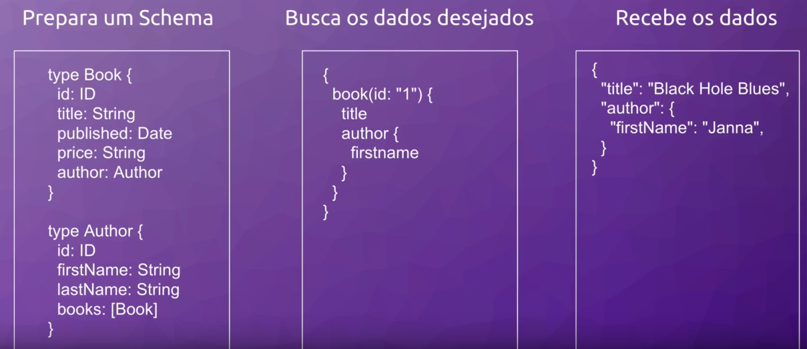

## O que é QraphQL?

É uma linguagem de consulta de dados desenvolvida pelo facebook para realizar requisiçoes e entregar informações para aplicações web e mobile desde 2012.

## Rest API e seus problemas

Fazemos uma requisição a um endpoint, uma rota predefinida, como por exemplo quero receber um determinado livro

### Problemas

1 - Caso nossa api tiver uma atualização, e entregar dados diferentes, se cria uma nova rota, e para que isso não acabe quebrando aplicações antigas, criamos uma nova versão, como por exemplo `api/v2/books/:id`.

2 - Se quisermos receber somente nome do livro, mas essa rota me retorna todos os dados do livro, acaba aumentando o tamanho da resposta sem necessidade, causando lentidão ao cliente, alem de prejudicar clientes com limite na cota de dados.

3 - Rotas autamente acoplados, por exemplo:
- Quero dados de livros, okak `api/v2/books`.
- Quero dados de autores, okak `api/v2/author`.
- Quero dados de livros, autores e editoras, terei que chamar 3 endpoints diferentes.

## Como funciona QraphQL?

- Definimos um schema
- E buscamos na query somente o que necessitamos
- E teremos só os dados solicitados

## Vantagens

- Permite a evolução constante, basta adicionar uma propriedade no schema que já fica disponivel na minha API, assim qualquer cliente pode solicicitar essa nova propriedade, sem precisar mudar sua rota.
- Entrego somente os dados requisitados, tamanho menor e resposta mais rápida.
- Rota única, assim temos dados altamente desacoplados

