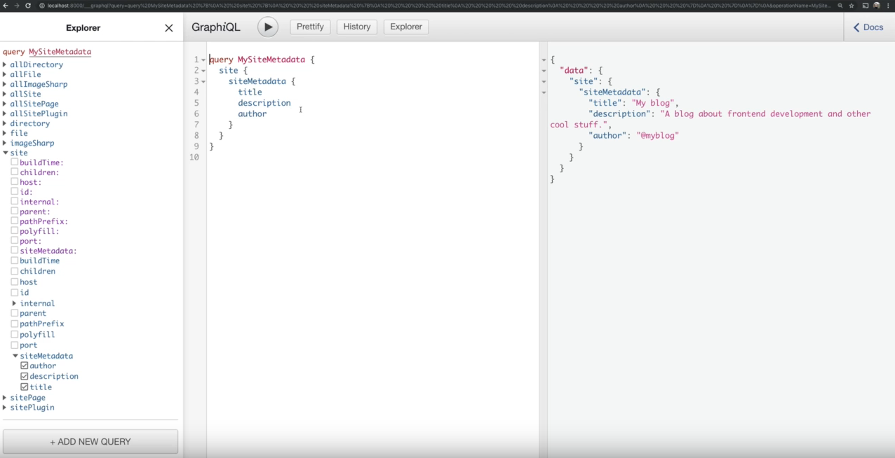

A url `http://localhost:8000/__graphql`, essa url vai abrir o <b>GraphiQL</b>, ele é uma <b>IDE</b> dentro do brownser que permite que a gente rode as nossas queries, e consiga explorar quais os dados que a gente tem do GraphQL de uma forma bem mais fácil.

- Explorer é todo o nosso schema disponivel


Query nomeada:
```
query nameQuery{
  name:'Leonardo'
}
```
Query sem nome:
```
{
  name:'Leonardo'
}
```
