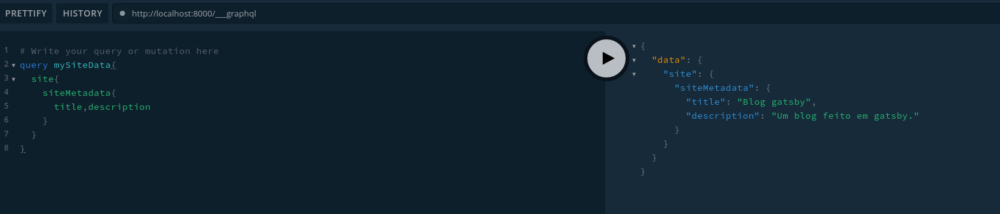

Agora é possivel ultilizar o prima playgraund, para isso adicione a seguinte linha no `package.json`.
```
"name-script": "GATSBY_GRAPHQL_IDE=playground gatsby develop"
```

E ao executar o comando na url `http://localhost:8000/___graphql`, e assim como no GraphiQL pode realizar nossas queries

