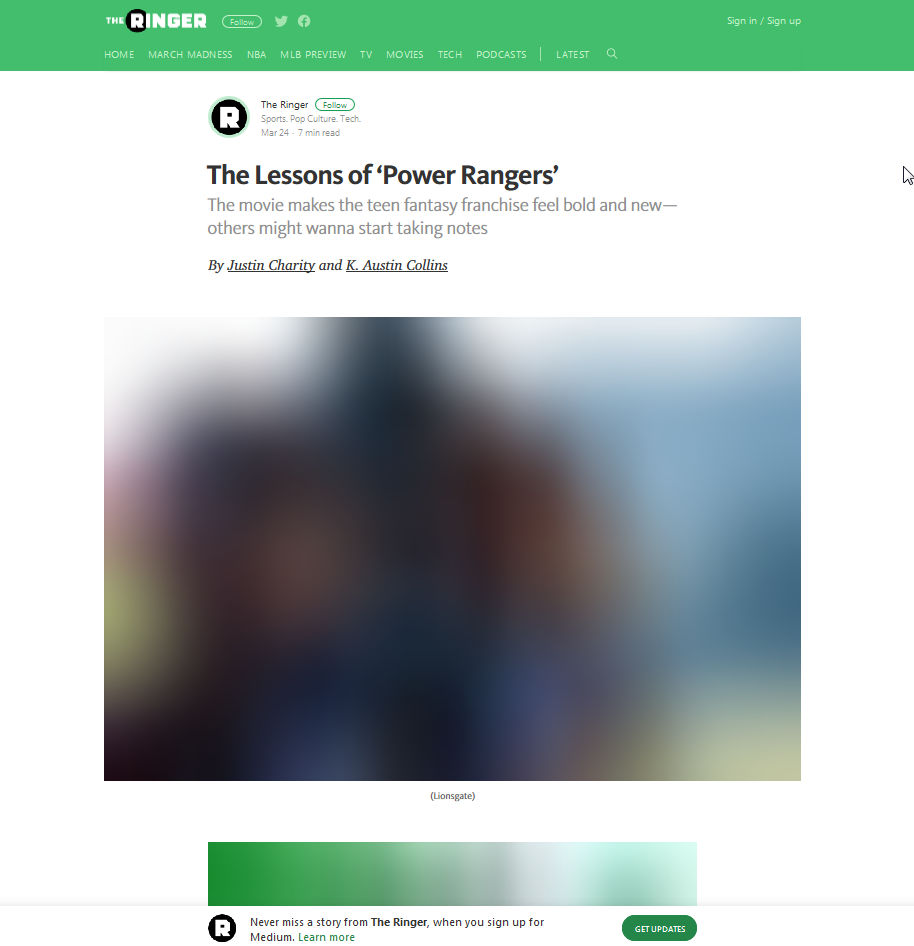

## Gatsby Image

O Gatsby foi feito pensando em performance, e umas das coisas mais problematicas pensando em performance, são imagem.

Geralmente são arquivos grandes, pensando em ter imagens de qualidade em nosso site. Pensando nisso o Gatsby tem o `gatsby-image`.

1 - Ele vai carregar o tamanho de imagem do tamanho de acordo com o tamanho do device/dispositivo/resolução. Se tiver em uma tela em 4k ele vai definir qual a melhor imagem.

2 - Não teremos problemas da imagem carregar do nada, deixando nosso layout feio e quebrado. Ele vai segurar a imagem na posição dela, aquele espaço já seja separado pra poder entrar a imagem ali.

3 - Efeito de blur-up, permitir que uma versão da imagem bem pequena, e vai expandir para o espaço que deve ocupar, assim já da uma sensação de como será a imagem. Efeito utilizado no medium



Outra alternativa é o traced placeholder utilizando svg, ele mostra um contorno e depois mostra o svg


4 - Lazy load, ele não vai travar a renderização para carregar a imagem, assim seu site vai carregar mais rápido.

5 - Permite usar WebP, é um formato mais otimizado para web, lembrando que não são todos os browser que tem suporte a este formato. 


## Como funciona o Gatsby Image?

Ele usa o sharp para tratamento de imagem, e para funcionar ela usa dois plugins, que podem ser encontrados em `gatsby-config.js`, que são:
- `gatsby-plugin-sharp`: Responsavel por pegar a biblioteca sharp e implementar dentro do gatsby.
- `gatsby-transformer-sharp`: É o responsavel por fazer de fato funcionar com a estrutura do gatsby.

Eles são responsaveis pela biblioteca sharp, mas tem o plugin responsavel por trabalhar com os arquivos dentro do gatsby, e esse plugin é o `gatsby-source-filesystem`.

```
plugins: [
  `gatsby-plugin-react-helmet`,
  {
    resolve: `gatsby-source-filesystem`,
    options: {
      name: `images`,
      path: `${__dirname}/src/images`,
    },
  },
  { // poderia ter outra pasta como
    resolve: `gatsby-source-filesystem`,
    options: {
      name: `pdf`,
      path: `${__dirname}/src/pdf`,
    },
  },
  `gatsby-transformer-sharp`,
  `gatsby-plugin-sharp`,
  ...
]
```